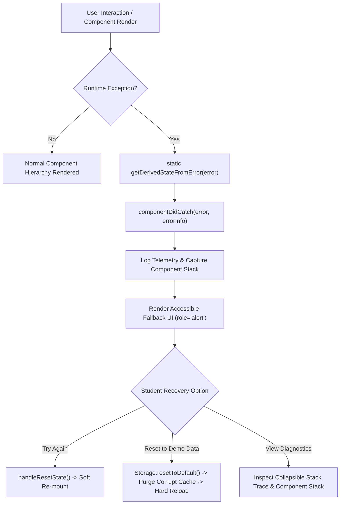

# AI Study Planner 🎓✨
> **A Modern, Professional, Student-Friendly Adaptive Study Scheduling Platform**

[](https://reactjs.org/)
[](https://tailwindcss.com/)
[](https://vitejs.dev/)
[-brightgreen.svg)](https://vitest.dev/)
[](LICENSE)

---

## 🌟 Overview

**AI Study Planner** helps students create a personalised, intelligent study plan powered by an adaptive AI planning engine. It analyses enrolled subjects, exam proximity, assignment deadlines, available study hours, difficult topics, and previous marks to generate a smart daily schedule and interactive timetable.

Unlike static planners, **AI Study Planner** dynamically re-adjusts when real life happens: missed sessions, shifted exam dates, new assignments, or finishing topics early.

---

## 🚀 Key Features

### 1. 🧠 Intelligent AI Planning Logic
- **Weighted Multi-Factor Algorithm**:
  - **Exam Proximity**: Subjects with upcoming exams within 7 days receive higher allocation and urgency alerts.
  - **Previous Performance**: Lower past marks trigger dedicated deep-work blocks and spaced formula revision.
  - **Subject Difficulty**: Balanced with student strengths to avoid burnout.
  - **Spaced Repetition & Health Breaks**: Interleaves 45–60 minute focus blocks with 10–15 minute hydration and stretch intervals.
  - **Student Time Preferences**: Schedules high-priority deep work during preferred peak concentration hours (Morning, Afternoon, Evening, Night).

### 2. ⚡ Dynamic Real-Time Re-planning
- **Missed a Session?** Automatically redistributes missed topics into upcoming revision buffers.
- **Exam Date Shifted?** Instantly recalculates priority rankings and timetable weights.
- **New Assignment Added?** Allocates a dedicated preparation block before the deadline.
- **Topic Completed Early?** Grants a bonus recovery break or advances the next priority.

### 3. 📅 Interactive Calendar (Weekly & Monthly)
- Color-coded views for **Study Sessions**, **Exams**, **Assignment Deadlines**, **Revision**, and **Breaks**.
- Click any date to view detailed scheduled activities and deadlines.

### 4. 📚 Comprehensive Subjects Hub
- Dynamic cards displaying:
  - Previous Mark (with low-mark warnings)
  - Difficulty Level (`High`, `Medium`, `Low`)
  - Exam Countdown (e.g. *5 days remaining*)
  - Progress percentage & topics completed
  - Identified difficult topics chips

### 5. 🤖 Interactive "AI Study Assistant" Chatbot
- Quick prompt pills:
  - *“What should I study today?”*
  - *“I have only 2 hours. Make a study plan.”*
  - *“My Mathematics exam is in 5 days. What should I focus on?”*
  - *“Give me a revision plan.”*
  - *“When should I take breaks?”*
- Contextual replies that understand your active profile and offer 1-click **“Apply to Timetable”** actions.

### 6. 📊 Progress Analytics & Gamification
- Visual weekly study hours distribution bar chart.
- Subject-wise curriculum coverage bars.
- 7-Day study streak tracker with milestone badges (`3-Day Starter`, `7-Day Scholar`, `14-Day Champion`, `30-Day Master`).
- Exam preparation readiness score.

### 7. ⏱️ Focus & Pomodoro Timer
- Built-in study timer supporting **25m Focus**, **50m Deep Work**, and **5m/15m Breaks**.
- Audio chimes and celebratory confetti when focus sessions are completed!

### 8. 🔔 Smart Notifications & Dark Mode
- Real-time reminder drawer for imminent exam dates, assignments, and study slots.
- Full light/dark mode support with smooth transitions.
- Offline `localStorage` persistence with pre-loaded realistic sample data.

---

## 🛡️ Error Boundaries & Resilience Architecture

The application implements a dedicated React **Error Boundary** ([`ErrorBoundary.jsx`](file:///c:/Users/pavit/Documents/AI%20Study%20Planner/src/components/common/ErrorBoundary.jsx)) wrapping the top-level tree in [`main.jsx`](file:///c:/Users/pavit/Documents/AI%20Study%20Planner/src/main.jsx) to prevent catastrophic complete unmounting (white-screen-of-death) during unexpected runtime failures.



### 1. React 18 Lifecycle Mechanics
The boundary leverages React's dual-phase error catching lifecycle:

1. **Render Phase (`static getDerivedStateFromError(error)`)**:
   - **Characteristics**: Pure, synchronous method executed during the render phase.
   - **Responsibility**: Returns state mutation `{ hasError: true, error }` so the immediate next render synchronously mounts the fallback UI without allowing an unhandled exception to bubble up to the browser root.
   - **Guarantees**: No side-effects are permitted in this method.

2. **Commit Phase (`componentDidCatch(error, errorInfo)`)**:
   - **Characteristics**: Executed during the commit phase after the DOM has been updated with the fallback UI.
   - **Responsibility**: Executes side-effects, telemetry logging, and external reporting.
   - **Telemetry Payload**:
     - `error.name`: Error class (e.g. `TypeError`, `ReferenceError`).
     - `error.message`: Detailed human-readable error description.
     - `error.stack`: JavaScript V8 execution stack trace.
     - `errorInfo.componentStack`: React fiber tree hierarchy pinpointing the exact offending component (e.g. `in CalendarGrid -> in CalendarView -> in App`).

### 2. Error Boundary Scope & Error Categorization
| Error Type | Caught by Error Boundary? | Mitigation & Handling Strategy |
| :--- | :---: | :--- |
| **Component Rendering Errors** | ✅ Yes | Caught immediately via `getDerivedStateFromError` |
| **Lifecycle Hook Exceptions** (`useEffect`, etc.) | ✅ Yes | Intercepted during render/commit reconciliation |
| **Child Component Constructors** | ✅ Yes | Trapped during instantiation |
| **Event Handlers** (`onClick`, `onSubmit`) | ❌ No | Handled locally via `try / catch` blocks with toast alerts |
| **Asynchronous Callbacks** (`setTimeout`, `fetch`) | ❌ No | Managed via promise `.catch()` or async/await `try/catch` |
| **Errors in Boundary Itself** | ❌ No | Mitigated by keeping `ErrorBoundary` render logic minimal |
| **Server-Side Rendering (SSR)** | ❌ No | Client-side only; caught post-hydration |

### 3. Multi-Tiered Recovery Flow
- **Tier 1: Soft Recovery (`handleResetState`)**:
  - Resets boundary state (`hasError: false`, `error: null`, `showDetails: false`).
  - Triggers React to re-attempt rendering the active tree without losing in-memory user inputs.
- **Tier 2: State Sanitization & Re-hydration (`handleResetDataAndReload`)**:
  - If a runtime error is caused by corrupted data in `localStorage` (e.g., malformed JSON or invalid schema from third-party extensions), clicking **"Reset to Demo Data"** calls [`Storage.resetToDefault()`](file:///c:/Users/pavit/Documents/AI%20Study%20Planner/src/utils/storage.js) and triggers `window.location.reload()`.
  - Replaces broken localStorage records with pristine factory defaults.
- **Tier 3: Collapsible Diagnostic Disclosure**:
  - Toggles a high-contrast mono-spaced diagnostic terminal with `error.stack` and `componentStack`.
  - Enables non-technical students to capture error reports for bug tickets.

### 4. Accessibility & Telemetry Integration
- **WCAG Compliance**: Container marked with `role="alert"` and `aria-live="assertive"`.
- **Keyboard Navigation**: Buttons include explicit focus rings, keyboard tabs, and semantic `aria-expanded` attributes on diagnostic toggles.
- **Production Telemetry Hook**: Readily connects to external observability providers (Sentry, Datadog, LogRocket, OpenTelemetry):
```javascript
componentDidCatch(error, errorInfo) {
  this.setState({ error, errorInfo });
  // Sentry / Telemetry Dispatch
  if (window.Sentry) {
    window.Sentry.captureException(error, { extra: errorInfo });
  }
}
```

---

## 🧪 Granular Unit Testing & QA Strategy

The application includes an automated unit test suite executed via **Vitest v4**. All core algorithms, mathematical formulas, date transformations, storage fault tolerance, and error boundaries are covered by unit tests.

### Test Execution Commands
```bash
# Execute all test suites once
npm test

# Run tests in interactive watch mode (re-runs on file changes)
npm run test:watch

# Execute specific test file
npx vitest run src/utils/aiPlanner.test.js
npx vitest run src/utils/storage.test.js
npx vitest run src/utils/dateHelpers.test.js
npx vitest run src/components/common/ErrorBoundary.test.jsx
```

### Test Suite Architecture & Verification Matrix
**Overall QA Summary:** **37 / 37 Tests Passing** across **4 Test Files** (100% pass rate).

| Test Suite File | Domain Tested | Test Cases & Specific Invariants Asserted | Tests | Status |
| :--- | :--- | :--- | :---: | :---: |
| [`aiPlanner.test.js`](file:///c:/Users/pavit/Documents/AI%20Study%20Planner/src/utils/aiPlanner.test.js) | AI Scheduling & Priority Engine | • Priority weighting: upcoming exam ($\le 3$d) + low past mark (55%) scored higher than distant exam (20d) + 92% mark.<br>• Assignment urgency boost: $+15$ bonus points applied when deadline $\le 3$ days.<br>• Fault tolerance: `null`, `undefined`, and malformed marks default to baseline 75 without crashing.<br>• Schedule generation: builds valid ordered task arrays with interleaved rest breaks.<br>• Circadian hour alignment: `Morning` maps to AM clock; `Evening` maps to PM clock.<br>• Empty state guards: empty subject array returns `[]` safely.<br>• Missed sessions: immutably tags task with `missed: true` and recovery advice.<br>• Early completions: sets `completed: true` and `earlyFinished: true` bonus flag.<br>• Assignment injection: injects 45m buffer block before deadline. | 9 | ✅ PASS |
| [`dateHelpers.test.js`](file:///c:/Users/pavit/Documents/AI%20Study%20Planner/src/utils/dateHelpers.test.js) | Date Math & Time Formatting | • `getDaysRemaining`: returns 0 for falsy/empty strings; calculates future day offsets correctly; returns 0 for today; returns negative integers for past dates.<br>• `getRelativeDaysText`: returns "Passed" for negative days, "Today" for 0, "Tomorrow" for 1, and "N days remaining" for $N > 1$.<br>• `getDateOffset`: generates valid ISO 8601 strings (`YYYY-MM-DD`).<br>• `getCurrentWeekDays`: generates array of 7 consecutive dates starting from Monday.<br>• `formatTimeRange`: formats start/end times with en-dash delimiter.<br>• `formatDate` & `formatShortDate`: handles falsy inputs and standardizes localized dates. | 13 | ✅ PASS |
| [`storage.test.js`](file:///c:/Users/pavit/Documents/AI%20Study%20Planner/src/utils/storage.test.js) | Persistence & Fallback Guardrails | • Profile retrieval: returns default initial profile when storage is empty.<br>• Profile mutation: saves and retrieves custom profiles accurately.<br>• Corrupt JSON handling: malformed JSON in localStorage logs warning and defaults to fallback without throwing.<br>• Subjects and tasks persistence: asserts roundtrip CRUD serialization.<br>• Theme configuration: defaults to 'light'; saves and retrieves 'dark'.<br>• `resetToDefault`: purges all keys and hydrates factory fixtures. | 8 | ✅ PASS |
| [`ErrorBoundary.test.jsx`](file:///c:/Users/pavit/Documents/AI%20Study%20Planner/src/components/common/ErrorBoundary.test.jsx) | Resilience & Error Boundary Lifecycle | • `getDerivedStateFromError`: returns `{ hasError: true, error }` synchronously.<br>• Initial state: asserts clean `hasError: false` upon instantiation.<br>• `componentDidCatch`: captures component stack and logs to `console.error`.<br>• `handleResetState`: resets state cleanly to enable re-mount.<br>• `handleResetDataAndReload`: calls `Storage.resetToDefault()` and `window.location.reload()`.<br>• Custom fallback prop: renders custom fallback when provided.<br>• Normal children render: renders child tree when `hasError: false`. | 7 | ✅ PASS |

### Continuous Integration (CI/CD Pipeline)
For automated verification in GitHub Actions, the following workflow (`.github/workflows/test.yml`) ensures no regressions enter the codebase:

```yaml
name: Test Suite & Quality Assurance
on: [push, pull_request]

jobs:
  test:
    runs-on: ubuntu-latest
    steps:
      - uses: actions/checkout@v4
      - uses: actions/setup-node@v4
        with:
          node-version: 20
          cache: 'npm'
      - run: npm ci
      - run: npm test
      - run: npm run build
```

---

## 🗄️ Database & Entity Schema Specification

The application follows a normalized relational model designed for cloud backends (PostgreSQL / Supabase / Neon / AWS RDS) and mapped locally to `localStorage`.

### 1. Entity-Relationship Diagram (ERD)

```mermaid
erDiagram
    STUDENT ||--o{ SUBJECT : enrolls_in
    STUDENT ||--o{ TASK : schedules
    STUDENT ||--o{ NOTIFICATION : receives
    STUDENT ||--o{ STUDY_ANALYTICS_LOG : logs
    SUBJECT ||--o{ TOPIC : contains
    SUBJECT ||--o{ ASSIGNMENT : has
    SUBJECT ||--o{ TASK : referenced_by
    STUDENT ||--o{ CLIENT_ERROR_TELEMETRY : reports

    STUDENT {
        uuid id PK
        varchar(100) name
        varchar(255) email UK
        varchar(255) academic_goal
        decimal(3,1) daily_hours
        varchar(20) preferred_time
        int streak_days
        decimal(6,2) total_hours_studied
        int consistency_score
        int target_exam_score
        timestamp created_at
        timestamp updated_at
    }

    SUBJECT {
        uuid id PK
        uuid student_id FK
        varchar(120) name
        decimal(5,2) previous_mark
        varchar(20) difficulty
        date exam_date
        decimal(5,2) progress
        int total_topics
        int completed_topics
        varchar(50) color_theme
        text[] difficult_topics
        timestamp created_at
    }

    TOPIC {
        uuid id PK
        uuid subject_id FK
        varchar(160) name
        boolean completed
        varchar(20) difficulty
        int sort_order
    }

    ASSIGNMENT {
        uuid id PK
        uuid subject_id FK
        uuid student_id FK
        varchar(200) title
        date deadline
        decimal(4,2) estimated_hours
        boolean completed
        varchar(20) priority
        timestamp created_at
    }

    TASK {
        uuid id PK
        uuid student_id FK
        uuid subject_id FK
        varchar(120) subject
        varchar(255) topic
        varchar(10) start_time
        varchar(10) end_time
        int duration_minutes
        varchar(30) priority
        boolean completed
        varchar(20) task_type
        boolean is_break
        boolean missed
        boolean early_finished
        text notes
        date scheduled_date
        int sort_order
    }

    NOTIFICATION {
        uuid id PK
        uuid student_id FK
        varchar(30) notification_type
        varchar(160) title
        text message
        boolean unread
        boolean urgent
        timestamp created_at
    }

    STUDY_ANALYTICS_LOG {
        uuid id PK
        uuid student_id FK
        uuid subject_id FK
        date study_date
        int minutes_studied
        int focus_rating
        timestamp created_at
    }

    CLIENT_ERROR_TELEMETRY {
        uuid id PK
        uuid student_id FK
        text error_message
        text stack_trace
        text component_stack
        varchar(255) user_agent
        timestamp created_at
    }
```

### 2. Relational DDL Specification (PostgreSQL)

```sql
-- Extensions
CREATE EXTENSION IF NOT EXISTS "uuid-ossp";

-- 1. Student Profiles Table
CREATE TABLE students (
    id UUID PRIMARY KEY DEFAULT uuid_generate_v4(),
    name VARCHAR(100) NOT NULL,
    email VARCHAR(255) UNIQUE NOT NULL,
    academic_goal VARCHAR(255) NOT NULL DEFAULT 'Academic Excellence',
    daily_hours DECIMAL(3, 1) NOT NULL DEFAULT 4.0 CHECK (daily_hours BETWEEN 0.5 AND 16.0),
    preferred_time VARCHAR(20) NOT NULL DEFAULT 'Evening' CHECK (preferred_time IN ('Morning', 'Afternoon', 'Evening', 'Night')),
    streak_days INT NOT NULL DEFAULT 0 CHECK (streak_days >= 0),
    total_hours_studied DECIMAL(6, 2) NOT NULL DEFAULT 0.0 CHECK (total_hours_studied >= 0.0),
    consistency_score INT NOT NULL DEFAULT 100 CHECK (consistency_score BETWEEN 0 AND 100),
    target_exam_score INT NOT NULL DEFAULT 90 CHECK (target_exam_score BETWEEN 0 AND 100),
    created_at TIMESTAMP WITH TIME ZONE DEFAULT CURRENT_TIMESTAMP,
    updated_at TIMESTAMP WITH TIME ZONE DEFAULT CURRENT_TIMESTAMP
);

-- 2. Curriculum Subjects Table
CREATE TABLE subjects (
    id UUID PRIMARY KEY DEFAULT uuid_generate_v4(),
    student_id UUID NOT NULL REFERENCES students(id) ON DELETE CASCADE,
    name VARCHAR(120) NOT NULL,
    previous_mark DECIMAL(5, 2) NOT NULL DEFAULT 75.00 CHECK (previous_mark BETWEEN 0.00 AND 100.00),
    difficulty VARCHAR(20) NOT NULL DEFAULT 'Medium' CHECK (difficulty IN ('High', 'Medium', 'Low')),
    exam_date DATE NOT NULL,
    progress DECIMAL(5, 2) NOT NULL DEFAULT 0.00 CHECK (progress BETWEEN 0.00 AND 100.00),
    total_topics INT NOT NULL DEFAULT 0 CHECK (total_topics >= 0),
    completed_topics INT NOT NULL DEFAULT 0 CHECK (completed_topics >= 0),
    color_theme VARCHAR(50) DEFAULT 'indigo',
    difficult_topics TEXT[] DEFAULT ARRAY[]::TEXT[],
    created_at TIMESTAMP WITH TIME ZONE DEFAULT CURRENT_TIMESTAMP
);

-- Indexes for performance
CREATE INDEX idx_subjects_student ON subjects(student_id);
CREATE INDEX idx_subjects_exam_date ON subjects(exam_date);

-- 3. Subject Topics Table
CREATE TABLE topics (
    id UUID PRIMARY KEY DEFAULT uuid_generate_v4(),
    subject_id UUID NOT NULL REFERENCES subjects(id) ON DELETE CASCADE,
    name VARCHAR(160) NOT NULL,
    completed BOOLEAN NOT NULL DEFAULT FALSE,
    difficulty VARCHAR(20) NOT NULL DEFAULT 'Medium' CHECK (difficulty IN ('High', 'Medium', 'Low')),
    sort_order INT NOT NULL DEFAULT 0
);
CREATE INDEX idx_topics_subject ON topics(subject_id);

-- 4. Assignments & Deadlines Table
CREATE TABLE assignments (
    id UUID PRIMARY KEY DEFAULT uuid_generate_v4(),
    student_id UUID NOT NULL REFERENCES students(id) ON DELETE CASCADE,
    subject_id UUID REFERENCES subjects(id) ON DELETE SET NULL,
    title VARCHAR(200) NOT NULL,
    deadline DATE NOT NULL,
    estimated_hours DECIMAL(4, 2) NOT NULL DEFAULT 2.0 CHECK (estimated_hours > 0),
    completed BOOLEAN NOT NULL DEFAULT FALSE,
    priority VARCHAR(20) NOT NULL DEFAULT 'Medium' CHECK (priority IN ('High', 'Medium', 'Low')),
    created_at TIMESTAMP WITH TIME ZONE DEFAULT CURRENT_TIMESTAMP
);
CREATE INDEX idx_assignments_deadline ON assignments(deadline);
CREATE INDEX idx_assignments_student ON assignments(student_id);

-- 5. Timetable Tasks & Study Sessions Table
CREATE TABLE tasks (
    id UUID PRIMARY KEY DEFAULT uuid_generate_v4(),
    student_id UUID NOT NULL REFERENCES students(id) ON DELETE CASCADE,
    subject_id UUID REFERENCES subjects(id) ON DELETE SET NULL,
    subject VARCHAR(120) NOT NULL,
    topic VARCHAR(255) NOT NULL,
    start_time VARCHAR(10) NOT NULL,
    end_time VARCHAR(10) NOT NULL,
    duration_minutes INT NOT NULL CHECK (duration_minutes > 0),
    priority VARCHAR(30) NOT NULL DEFAULT 'Medium Priority' CHECK (priority IN ('High Priority', 'Medium Priority', 'Low Priority')),
    completed BOOLEAN NOT NULL DEFAULT FALSE,
    task_type VARCHAR(20) NOT NULL DEFAULT 'study' CHECK (task_type IN ('study', 'break', 'revision', 'assignment')),
    is_break BOOLEAN NOT NULL DEFAULT FALSE,
    missed BOOLEAN NOT NULL DEFAULT FALSE,
    early_finished BOOLEAN NOT NULL DEFAULT FALSE,
    notes TEXT DEFAULT '',
    scheduled_date DATE NOT NULL DEFAULT CURRENT_DATE,
    sort_order INT NOT NULL DEFAULT 0,
    created_at TIMESTAMP WITH TIME ZONE DEFAULT CURRENT_TIMESTAMP
);
CREATE INDEX idx_tasks_student_date ON tasks(student_id, scheduled_date);

-- 6. Notifications Feed Table
CREATE TABLE notifications (
    id UUID PRIMARY KEY DEFAULT uuid_generate_v4(),
    student_id UUID NOT NULL REFERENCES students(id) ON DELETE CASCADE,
    notification_type VARCHAR(30) NOT NULL CHECK (notification_type IN ('exam', 'assignment', 'session', 'success', 'warning')),
    title VARCHAR(160) NOT NULL,
    message TEXT NOT NULL,
    unread BOOLEAN NOT NULL DEFAULT TRUE,
    urgent BOOLEAN NOT NULL DEFAULT FALSE,
    created_at TIMESTAMP WITH TIME ZONE DEFAULT CURRENT_TIMESTAMP
);
CREATE INDEX idx_notifications_student ON notifications(student_id, unread);

-- 7. Client Error Telemetry Table
CREATE TABLE client_error_telemetry (
    id UUID PRIMARY KEY DEFAULT uuid_generate_v4(),
    student_id UUID REFERENCES students(id) ON DELETE SET NULL,
    error_message TEXT NOT NULL,
    stack_trace TEXT,
    component_stack TEXT,
    user_agent VARCHAR(255),
    created_at TIMESTAMP WITH TIME ZONE DEFAULT CURRENT_TIMESTAMP
);
```

### 3. NoSQL / Document Store Schema Alternative (MongoDB / Firestore)
For serverless architectures or mobile synchronization, student data maps naturally to document collections:

```json
{
  "_id": "67040445d4304899c7198811",
  "name": "Alex Rivera",
  "email": "alex.rivera@university.edu",
  "academicGoal": "Score >90% in Semester Finals",
  "dailyHours": 4.0,
  "preferredTime": "Evening",
  "streakDays": 7,
  "consistencyScore": 94,
  "subjects": [
    {
      "id": "sub-1",
      "name": "Mathematics",
      "previousMark": 55,
      "difficulty": "High",
      "examDate": "2026-10-12T00:00:00Z",
      "progress": 65,
      "difficultTopics": ["Integral Calculus", "Differential Equations"],
      "topics": [
        { "id": "t1", "name": "Linear Algebra", "completed": true }
      ]
    }
  ],
  "assignments": [
    {
      "id": "asg-1",
      "subjectId": "sub-1",
      "title": "Integration Problem Set",
      "deadline": "2026-10-10",
      "completed": false
    }
  ]
}
```

---

## 🌐 API Endpoints Architecture (RESTful Specification)

Below is the OpenAPI 3.0 compatible specification for cloud backend integration (e.g. Node.js/Express, FastAPI, NestJS, or Next.js API Routes).

### Global Conventions
- **Base URL**: `https://api.aistudyplanner.com/api/v1`
- **Standard Headers**:
  - `Content-Type: application/json`
  - `Authorization: Bearer <JWT_ACCESS_TOKEN>`
  - `X-Student-Id: <UUID>`
- **Error Format (RFC 7807 Problem Details)**:
```json
{
  "type": "https://api.aistudyplanner.com/errors/validation-error",
  "title": "Unprocessable Entity",
  "status": 422,
  "detail": "Exam date cannot be set in the past.",
  "instance": "/api/v1/subjects",
  "timestamp": "2026-10-07T15:45:00Z"
}
```

---

### 1. Student Profile & Preferences

#### `GET /api/v1/profile`
Retrieves student profile, study habits, target score, and streak history.
- **Response (200 OK):**
```json
{
  "success": true,
  "data": {
    "id": "d16d6e09-fa6a-4a7b-a8fb-e7ad9c3f8e3e",
    "name": "Alex Rivera",
    "email": "alex.rivera@university.edu",
    "academicGoal": "Score >90% in Semester Finals & Build Solid Fundamentals",
    "dailyHours": 4.0,
    "preferredTime": "Evening",
    "streakDays": 7,
    "totalHoursStudied": 42.5,
    "consistencyScore": 94,
    "targetExamScore": 90
  }
}
```

#### `PUT /api/v1/profile`
Updates student study preferences and daily commitments.
- **Request Body:**
```json
{
  "dailyHours": 5.0,
  "preferredTime": "Morning",
  "targetExamScore": 95,
  "academicGoal": "Master Data Structures & Ace Finals"
}
```
- **Response (200 OK):** Updated student profile payload.

---

### 2. Subjects & Curriculum Management

#### `GET /api/v1/subjects`
Returns all enrolled subjects with syllabus breakdown and exam countdown.
- **Response (200 OK):**
```json
{
  "success": true,
  "count": 4,
  "data": [
    {
      "id": "sub-1",
      "name": "Mathematics",
      "previousMark": 55,
      "difficulty": "High",
      "examDate": "2026-10-12",
      "daysRemaining": 5,
      "progress": 65,
      "difficultTopics": ["Integral Calculus", "Trigonometric Identities"]
    }
  ]
}
```

#### `POST /api/v1/subjects`
Enrolls a new subject with syllabus topics.
- **Request Body:**
```json
{
  "name": "Organic Chemistry",
  "previousMark": 68,
  "difficulty": "High",
  "examDate": "2026-11-04",
  "difficultTopics": ["Reaction Mechanisms", "Stereochemistry"]
}
```
- **Response (201 Created):** Returns created subject entity with generated UUID.

#### `DELETE /api/v1/subjects/{id}`
Deletes a subject and cascades deletion of its associated assignments and topic logs.
- **Response (200 OK):** `{ "success": true, "message": "Subject removed successfully." }`

---

### 3. Assignments & Deadlines

#### `GET /api/v1/assignments`
Retrieves pending and completed assignments sorted by deadline proximity.
- **Query Parameters:** `completed=false&urgency=upcoming`
- **Response (200 OK):**
```json
{
  "success": true,
  "data": [
    {
      "id": "asg-1",
      "subjectId": "sub-3",
      "subjectName": "Physics",
      "title": "Electromagnetism Lab Report",
      "deadline": "2026-10-09",
      "daysRemaining": 2,
      "estimatedHours": 2.5,
      "completed": false,
      "priority": "High"
    }
  ]
}
```

#### `PATCH /api/v1/assignments/{id}/status`
Toggles assignment completion status.
- **Request Body:** `{ "completed": true }`
- **Response (200 OK):** `{ "success": true, "id": "asg-1", "completed": true }`

---

### 4. AI Adaptive Planner Engine

#### `POST /api/v1/planner/generate`
Generates an optimized, weighted daily study schedule based on multi-factor algorithms.
- **Request Body:**
```json
{
  "profile": {
    "dailyHours": 4.0,
    "preferredTime": "Evening"
  },
  "subjects": [
    {
      "id": "sub-1",
      "name": "Mathematics",
      "previousMark": 55,
      "difficulty": "High",
      "examDate": "2026-10-12",
      "difficultTopics": ["Integral Calculus"]
    },
    {
      "id": "sub-2",
      "name": "Programming (Python)",
      "previousMark": 88,
      "difficulty": "Medium",
      "examDate": "2026-10-21",
      "difficultTopics": ["Recursion"]
    }
  ],
  "assignments": [
    {
      "id": "asg-1",
      "subjectId": "sub-1",
      "deadline": "2026-10-09",
      "completed": false
    }
  ]
}
```
- **Response (200 OK):**
```json
{
  "success": true,
  "data": {
    "generatedAt": "2026-10-07T15:00:00Z",
    "totalStudyMinutes": 185,
    "tasks": [
      {
        "id": "task-1",
        "subjectId": "sub-1",
        "subject": "Mathematics",
        "topic": "Integral Calculus (Deep Work)",
        "startTime": "6:00 PM",
        "endTime": "7:00 PM",
        "duration": 60,
        "priority": "High Priority",
        "type": "study",
        "notes": "High priority session. Exam in 5 days. Focus on high-yield questions."
      },
      {
        "id": "task-2",
        "subject": "Break",
        "topic": "Hydration, light stretch & eye rest",
        "startTime": "7:00 PM",
        "endTime": "7:15 PM",
        "duration": 15,
        "priority": "Low Priority",
        "type": "break",
        "isBreak": true
      },
      {
        "id": "task-3",
        "subjectId": "sub-2",
        "subject": "Programming (Python)",
        "topic": "Recursion",
        "startTime": "7:15 PM",
        "endTime": "8:05 PM",
        "duration": 50,
        "priority": "Medium Priority",
        "type": "study"
      },
      {
        "id": "task-4",
        "subject": "Break",
        "topic": "Step outside or relax your posture",
        "startTime": "8:05 PM",
        "endTime": "8:15 PM",
        "duration": 10,
        "priority": "Low Priority",
        "type": "break",
        "isBreak": true
      },
      {
        "id": "task-5",
        "subjectId": "sub-1",
        "subject": "Revision",
        "topic": "Mathematics – Formula Sheet & Active Recall",
        "startTime": "8:15 PM",
        "endTime": "8:45 PM",
        "duration": 30,
        "priority": "High Priority",
        "type": "revision"
      }
    ]
  }
}
```

#### `POST /api/v1/planner/replan`
Dynamically recalculates schedule following external real-world triggers.
- **Request Body:**
```json
{
  "trigger": "MISSED_SESSION",
  "taskId": "task-1",
  "currentSchedule": [ /* array of active tasks */ ],
  "context": {
    "reason": "Student ran out of time",
    "targetDate": "2026-10-08"
  }
}
```
*Triggers Supported:*
- `MISSED_SESSION`: Re-queues topic into tomorrow's priority revision block.
- `EXAM_DATE_SHIFT`: Re-weights proximity scores and increases study allocation.
- `EARLY_FINISH`: Marks task completed and grants bonus recovery rest.
- `ADD_ASSIGNMENT`: Injects 45-minute buffer preparation session before deadline.
- **Response (200 OK):**
```json
{
  "success": true,
  "message": "Schedule rebalanced. Missed topic re-queued into tomorrow's priority revision block.",
  "updatedTasks": [ /* ... */ ]
}
```

---

### 5. AI Assistant & Conversational Agent

#### `POST /api/v1/assistant/chat`
Conversational endpoint for the interactive AI Study Assistant.
- **Request Body:**
```json
{
  "message": "I have only 2 hours. Make a study plan.",
  "studentContext": {
    "dailyTarget": 4.0,
    "enrolledSubjects": ["Mathematics", "Programming (Python)"]
  }
}
```
- **Response (200 OK):**
```json
{
  "success": true,
  "reply": "Here is a high-efficiency 2-Hour High-Yield Sprint: 50m Mathematics Deep Work, 10m Break, 40m Programming, and 20m Spaced Revision.",
  "suggestedActions": [
    {
      "actionType": "apply_2hr",
      "label": "Apply 2-Hour Sprint to Schedule",
      "payload": { "totalDuration": 120 }
    }
  ]
}
```

#### `POST /api/v1/assistant/action/apply`
Applies an AI Assistant recommendation directly to the student's timetable.
- **Request Body:**
```json
{
  "actionType": "apply_2hr"
}
```
- **Response (200 OK):** `{ "success": true, "message": "Applied 2-Hour High-Yield Sprint to your schedule!" }`

---

### 6. Client Telemetry & Error Reporting

#### `POST /api/v1/telemetry/errors`
Receives uncaught exceptions caught by [`ErrorBoundary.jsx`](file:///c:/Users/pavit/Documents/AI%20Study%20Planner/src/components/common/ErrorBoundary.jsx).
- **Request Body:**
```json
{
  "errorMessage": "Cannot read properties of undefined (reading 'examDate')",
  "stackTrace": "TypeError: Cannot read properties of undefined...\n    at calculateSubjectPriority",
  "componentStack": "\n    in TodayPlan\n    in App\n    in ErrorBoundary",
  "timestamp": "2026-10-07T15:50:12Z",
  "userAgent": "Mozilla/5.0 (Windows NT 10.0; Win64; x64)..."
}
```
- **Response (201 Created):** `{ "success": true, "incidentId": "inc-88421" }`

---

## 💻 Quick Start Guide

### Prerequisites
- Node.js (v18 or higher)
- npm (v9 or higher)

### Installation

```bash
# Clone the repository
git clone https://github.com/pavithran8072-bit/pavithran123.git

# Navigate to project directory
cd "AI Study Planner"

# Install dependencies
npm install

# Start development server
npm run dev
```

Visit `http://localhost:3000` in your web browser.

### Automated Testing & Build

```bash
# Run all 37 automated unit tests
npm test

# Run tests in continuous watch mode
npm run test:watch

# Build production bundle
npm run build
```

---

## 📝 Demo Walkthrough

1. **Home**: Review key metrics in the visual dashboard and click **"Create My Study Plan"**.
2. **AI Generator**: Enter student goals and subjects (e.g. Mathematics 55% mark, 5 days remaining) and click **"Generate AI Study Plan"**.
3. **Planner**: Check off tasks, test the Pomodoro focus timer, reorder sessions, or test the **Dynamic Re-planning** simulation buttons in the top banner:
   - **Simulate Missed Session**: Automatically rebalances the schedule and flags the missed topic for tomorrow's revision block.
   - **Simulate Exam Date Shift**: Pulls the exam closer and boosts allocation.
   - **Simulate New Assignment**: Injects a dedicated 45-minute preparation buffer session.
   - **Simulate Early Finish**: Rewards student with confetti and early-finish bonus points.
4. **Calendar**: Toggle between Weekly and Monthly calendar views and click any day to inspect tasks.
5. **AI Assistant**: Click on prompt pills like *"I have only 2 hours"* and apply the condensed plan directly to your schedule.
6. **Progress**: Inspect weekly study hours, subject mastery, and study streak badges.

---

## 📄 License
MIT License. Created for students to study smarter, eliminate burnout, and achieve academic excellence.
