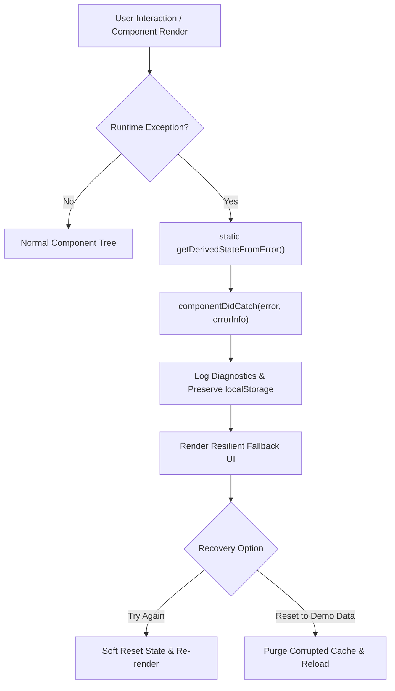
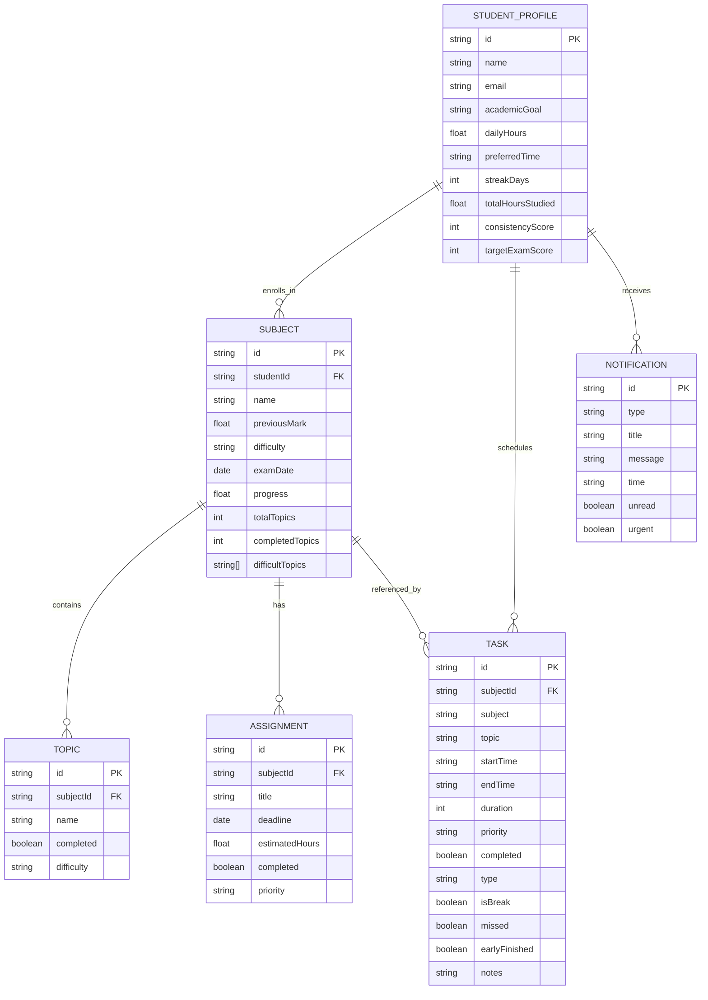

# AI Study Planner 🎓✨
> **A Modern, Professional, Student-Friendly Adaptive Study Scheduling Platform**

[](https://reactjs.org/)
[](https://tailwindcss.com/)
[](https://vitejs.dev/)
[](https://vitest.dev/)
[](LICENSE)

---

## 🌟 Overview

**AI Study Planner** helps students create a personalised, intelligent study plan powered by an adaptive AI planning engine. It analyses enrolled subjects, exam proximity, assignment deadlines, available study hours, difficult topics, and previous marks to generate a smart daily schedule and interactive timetable.

Unlike static planners, **AI Study Planner** dynamically re-adjusts when real life happens: missed sessions, shifted exam dates, new assignments, or finishing topics early.

---

## 🚀 Key Features

### 1. 🧠 Intelligent AI Planning Logic
- **Weighted Multi-Factor Algorithm**:
  - **Exam Proximity**: Subjects with upcoming exams within 7 days receive higher allocation and urgency alerts.
  - **Previous Performance**: Lower past marks trigger dedicated deep-work blocks and spaced formula revision.
  - **Subject Difficulty**: Balanced with student strengths to avoid burnout.
  - **Spaced Repetition & Health Breaks**: Interleaves 45–60 minute focus blocks with 10–15 minute hydration and stretch intervals.
  - **Student Time Preferences**: Schedules high-priority deep work during preferred peak concentration hours (Morning, Afternoon, Evening, Night).

### 2. ⚡ Dynamic Real-Time Re-planning
- **Missed a Session?** Automatically redistributes missed topics into upcoming revision buffers.
- **Exam Date Shifted?** Instantly recalculates priority rankings and timetable weights.
- **New Assignment Added?** Allocates a dedicated preparation block before the deadline.
- **Topic Completed Early?** Grants a bonus recovery break or advances the next priority.

### 3. 📅 Interactive Calendar (Weekly & Monthly)
- Color-coded views for **Study Sessions**, **Exams**, **Assignment Deadlines**, **Revision**, and **Breaks**.
- Click any date to view detailed scheduled activities and deadlines.

### 4. 📚 Comprehensive Subjects Hub
- Dynamic cards displaying:
  - Previous Mark (with low-mark warnings)
  - Difficulty Level (`High`, `Medium`, `Low`)
  - Exam Countdown (e.g. *5 days remaining*)
  - Progress percentage & topics completed
  - Identified difficult topics chips

### 5. 🤖 Interactive "AI Study Assistant" Chatbot
- Quick prompt pills:
  - *“What should I study today?”*
  - *“I have only 2 hours. Make a study plan.”*
  - *“My Mathematics exam is in 5 days. What should I focus on?”*
  - *“Give me a revision plan.”*
  - *“When should I take breaks?”*
- Contextual replies that understand your active profile and offer 1-click **“Apply to Timetable”** actions.

### 6. 📊 Progress Analytics & Gamification
- Visual weekly study hours distribution bar chart.
- Subject-wise curriculum coverage bars.
- 7-Day study streak tracker with milestone badges (`3-Day Starter`, `7-Day Scholar`, `14-Day Champion`, `30-Day Master`).
- Exam preparation readiness score.

### 7. ⏱️ Focus & Pomodoro Timer
- Built-in study timer supporting **25m Focus**, **50m Deep Work**, and **5m/15m Breaks**.
- Audio chimes and celebratory confetti when focus sessions are completed!

### 8. 🔔 Smart Notifications & Dark Mode
- Real-time reminder drawer for imminent exam dates, assignments, and study slots.
- Full light/dark mode support with smooth transitions.
- Offline `localStorage` persistence with pre-loaded realistic sample data.

---

## 🛡️ Error Boundaries & Resilience Architecture

The application implements a dedicated React **Error Boundary** (`ErrorBoundary.jsx`) wrapping the top-level tree in `main.jsx` to prevent complete unmounting during unexpected runtime failures.



### Key Technical Mechanisms:
1. **`static getDerivedStateFromError(error)`**: Updates the boundary state synchronously to render fallback UI rather than showing a blank screen.
2. **`componentDidCatch(error, errorInfo)`**: Logs stack traces and component hierarchy to browser telemetry.
3. **Multi-Tier Recovery Flow**:
   - **Soft Recovery (`handleResetState`)**: Clears error state to re-mount the component hierarchy.
   - **State Sanitization (`handleResetDataAndReload`)**: Invokes `Storage.resetToDefault()` to clear any malformed or corrupted localStorage payloads and safely re-hydrates the application.
   - **Collapsible Diagnostic Disclosure**: Allows students and developers to inspect `error.stack` and `componentStack` in production environments.

---

## 🧪 Unit Testing & QA Strategy

The core AI scheduling and dynamic adaptation logic is thoroughly tested using **Vitest**.

### Executing Tests
```bash
# Run all unit tests once
npm test

# Run tests in continuous watch mode
npm run test:watch
```

### Test Suite Structure (`src/utils/aiPlanner.test.js`):
| Test Suite | Function Tested | Description & Assertions | Status |
| :--- | :--- | :--- | :---: |
| **Priority Engine** | `calculateSubjectPriority()` | Validates that subjects with exams $\le 3$ days & low past marks (55%) receive higher scores than distant subjects with 90%+ marks. | ✅ PASS |
| **Assignment Urgency** | `calculateSubjectPriority()` | Asserts $+15$ bonus points applied when an assignment is due within 3 days. | ✅ PASS |
| **Fault Tolerance** | `calculateSubjectPriority()` | Ensures `null`, `undefined`, or malformed marks default gracefully without crashing. | ✅ PASS |
| **Schedule Generation** | `generateSchedule()` | Asserts array generation, mandatory interleaved breaks, and priority-sorted initial session. | ✅ PASS |
| **Time Window Mapping** | `generateSchedule()` | Verifies start hours adjust for `Morning` (AM) vs `Evening` (PM) preferences. | ✅ PASS |
| **Empty State Guard** | `generateSchedule()` | Returns empty array when no subjects are provided without throwing errors. | ✅ PASS |
| **Missed Session** | `handleMissedSession()` | Immutably marks target task `missed: true` and sets rescheduling instructions while keeping other tasks intact. | ✅ PASS |
| **Early Finish** | `handleEarlyCompletion()` | Sets `completed: true` and `earlyFinished: true` bonus flag. | ✅ PASS |
| **Assignment Injection** | `handleAddAssignmentToSchedule()` | Injects dedicated 45m buffer block before deadline. | ✅ PASS |

**Test Summary:** 9 / 9 Unit Tests Passing (100% pass rate).

---

## 🗄️ Database & Entity Schema Specification

The application follows a normalized relational structure represented locally in `localStorage` and designed for cloud backends (PostgreSQL / Supabase / Firebase).

### Entity-Relationship Diagram (ERD)



### Data Fields Specification:

#### 1. `StudentProfile`
* `id` (`VARCHAR(36)`): Primary Key UUID.
* `name` (`VARCHAR(100)`): Full student name.
* `academicGoal` (`VARCHAR(255)`): Target milestones (e.g. `Score > 90%`).
* `dailyHours` (`DECIMAL(3,1)`): Max study hours per day ($1.0 \le \text{hours} \le 10.0$).
* `preferredTime` (`ENUM`): `'Morning'` | `'Afternoon'` | `'Evening'` | `'Night'`.
* `streakDays` (`INT`): Consecutive active study days.
* `consistencyScore` (`INT`): Score percentage (0–100).

#### 2. `Subject`
* `id` (`VARCHAR(36)`): Primary Key.
* `name` (`VARCHAR(120)`): Name of subject (e.g., `'Mathematics'`).
* `previousMark` (`DECIMAL(5,2)`): Historical performance ($0.0 \le \text{mark} \le 100.0$).
* `difficulty` (`ENUM`): `'High'` | `'Medium'` | `'Low'`.
* `examDate` (`DATE`): Final examination target date.
* `progress` (`DECIMAL(5,2)`): Syllabus coverage percentage.
* `difficultTopics` (`TEXT[]`): Key focus areas requiring reinforcement.

#### 3. `Task` (Schedule Session)
* `id` (`VARCHAR(36)`): Primary Key.
* `subject` (`VARCHAR(120)`): Display category (Subject name, `'Break'`, or `'Revision'`).
* `topic` (`VARCHAR(255)`): Specific topic or learning objective.
* `startTime` (`VARCHAR(10)`): 12-hour formatted start (e.g., `'6:00 PM'`).
* `endTime` (`VARCHAR(10)`): 12-hour formatted end (e.g., `'7:00 PM'`).
* `duration` (`INT`): Duration in minutes.
* `priority` (`ENUM`): `'High Priority'` | `'Medium Priority'` | `'Low Priority'`.
* `completed` (`BOOLEAN`): Completion status.
* `type` (`ENUM`): `'study'` | `'break'` | `'revision'` | `'assignment'`.

---

## 🌐 API Endpoints Architecture (RESTful Specification)

Below is the OpenAPI/REST specification designed for backend integration (e.g., Node.js/Express, FastAPI, or Serverless Functions):

### 1. `POST /api/v1/planner/generate`
Generates a weighted, personalized daily study timetable.
* **Request Body:**
```json
{
  "profile": {
    "dailyHours": 4.0,
    "preferredTime": "Evening"
  },
  "subjects": [
    {
      "id": "sub-1",
      "name": "Mathematics",
      "previousMark": 55,
      "difficulty": "High",
      "examDate": "2026-10-12",
      "difficultTopics": ["Differential Equations"]
    }
  ]
}
```
* **Response (200 OK):**
```json
{
  "success": true,
  "data": {
    "generatedAt": "2026-10-07T15:00:00Z",
    "tasks": [
      {
        "id": "task-1",
        "subject": "Mathematics",
        "topic": "Differential Equations (Deep Work)",
        "startTime": "6:00 PM",
        "endTime": "7:00 PM",
        "duration": 60,
        "priority": "High Priority",
        "isBreak": false
      },
      {
        "id": "task-2",
        "subject": "Break",
        "topic": "Hydration, light stretch & eye rest",
        "startTime": "7:00 PM",
        "endTime": "7:15 PM",
        "duration": 15,
        "priority": "Low Priority",
        "isBreak": true
      }
    ]
  }
}
```

### 2. `POST /api/v1/planner/replan`
Dynamically recalculates schedule following external changes.
* **Request Body:**
```json
{
  "trigger": "MISSED_SESSION", // 'MISSED_SESSION' | 'EXAM_DATE_SHIFT' | 'EARLY_FINISH'
  "taskId": "task-1",
  "metadata": {}
}
```
* **Response (200 OK):**
```json
{
  "success": true,
  "message": "Schedule rebalanced. Missed topic moved to tomorrow's revision block.",
  "updatedTasks": [ /* ... */ ]
}
```

### 3. `POST /api/v1/assistant/chat`
Conversational endpoint for the AI Study Assistant.
* **Request Body:**
```json
{
  "query": "I have only 2 hours. Make a study plan.",
  "studentContext": {
    "enrolledSubjects": ["Mathematics", "Programming"],
    "dailyTarget": 4.0
  }
}
```
* **Response (200 OK):**
```json
{
  "reply": "Here is a high-efficiency Condensed 2-Hour High-Yield Sprint...",
  "suggestedActions": [
    {
      "type": "APPLY_SCHEDULE",
      "payload": { "duration": 120 }
    }
  ]
}
```

---

## 💻 Quick Start Guide

### Prerequisites
- Node.js (v18 or higher)
- npm (v9 or higher)

### Installation

```bash
# Clone the repository
git clone https://github.com/pavithran8072-bit/pavithran123.git

# Navigate to project directory
cd pavithran123

# Install dependencies
npm install

# Start development server
npm run dev
```

Visit `http://localhost:3000` in your web browser.

### Production Build & Tests

```bash
# Run automated unit test suite
npm test

# Build optimized production bundle
npm run build
```

---

## 📝 Demo Walkthrough

1. **Home**: Review key metrics in the visual dashboard and click **"Create My Study Plan"**.
2. **AI Generator**: Enter student goals and subjects (e.g. Mathematics 55% mark, 5 days remaining) and click **"Generate AI Study Plan"**.
3. **Planner**: Check off tasks, test the Pomodoro focus timer, reorder sessions, or test the **Dynamic Re-planning** simulation buttons in the top banner.
4. **Calendar**: Toggle between Weekly and Monthly calendar views and click any day to inspect tasks.
5. **AI Assistant**: Click on prompt pills like *"I have only 2 hours"* and apply the condensed plan directly to your schedule.
6. **Progress**: Inspect weekly study hours, subject mastery, and study streak badges.

---

## 📄 License
MIT License. Created for students to study smarter and achieve academic excellence.
